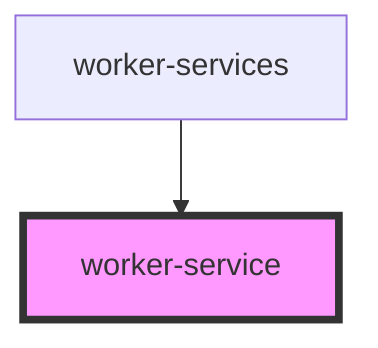

# worker-service

<!-- Auto Generated Below -->

## Properties

| Property  | Attribute | Description | Type             | Default     |
| --------- | --------- | ----------- | ---------------- | ----------- |
| `service` | --        |             | `IWorkerService` | `undefined` |

## Dependencies

### Used by

 - [worker-services](../worker-services)

### Graph

----------------------------------------------

*Built with [StencilJS](https://stenciljs.com/)*
