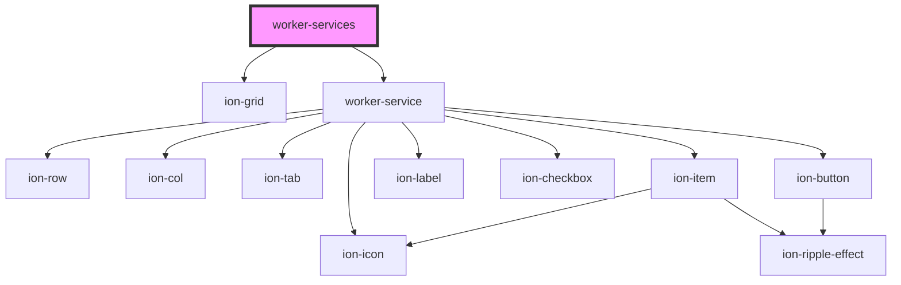

# worker-services

<!-- Auto Generated Below -->

## Properties

| Property   | Attribute | Description | Type               | Default |
| ---------- | --------- | ----------- | ------------------ | ------- |
| `services` | --        |             | `IWorkerService[]` | `[]`    |

## Dependencies

### Depends on

- ion-grid
- [worker-service](../worker-service)

### Graph

----------------------------------------------

*Built with [StencilJS](https://stenciljs.com/)*
